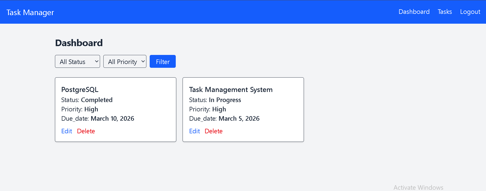
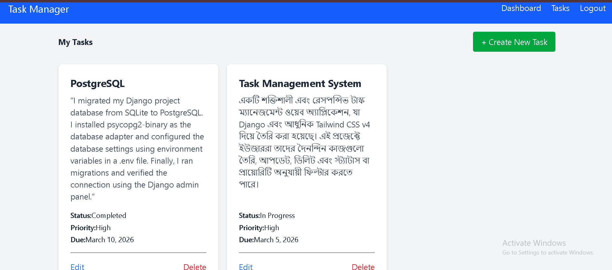

# 🚀 Django Task Manager (Dockerized)
A high-performance Task Management system with a focus on scalable backend architecture, containerization, and secure API delivery.

---

## 🚀 Project Goal

The goal of this project is to learn an implement:
- Django Backend Development
- Authentication System
- CRUD Operations
- Responsive UI Improvement
- PostgreSQL Database Integration
- REST API Development
- Deployment
- Advanced API Features(API Pagination,Search API,Filter API)

---

## 🛠 Tech Stack

- Backend: Python, Django, Django REST Framework (DRF)

- Authentication: JWT (SimpleJWT) & Token-based Auth

- Database: PostgreSQL (Development via Docker | Production via Neon)

- Caching: Redis (via Upstash for production)

- Containerization: Docker & Docker Compose

- Frontend: HTML, Tailwind CSS v4, JavaScript

- Deployment: Render

---

## ✨ Professional Features
- Containerized Architecture: Fully dockerized setup for seamless development.

- RESTful API: Complete CRUD API endpoints with IsAuthenticated permissions.

- Secure Auth: Multi-layer authentication using Login Forms and JWT Tokens.

- Persistent Storage: Integrated with PostgreSQL for reliable data management.

- Performance: Caching implemented with Redis to optimize server response.

- Environment Aware: Dynamic settings for local Docker and live production.

---

## 📂 Project Structure

```text
Task-Management-System/
├── core/                # Configuration (settings, urls, wsgi)
├── tasks/               # Core Logic (models, views, serializers, signals)
├── Dockerfile           # Production-ready Docker recipe
├── docker-compose.yml   # Multi-container orchestration
├── requirements.txt     # Dependency management
└── README.md            # Professional documentation
```

--- 

## ⚙️ Quick Start (Docker)

# Clone the repository
git clone https://github.com/mamun-2025/task-management-system

# Run with Docker
docker-compose up --build

# Apply Migrations
docker-compose exec web python manage.py migrate

---

## 🧪 API Testing (Postman)

- JWT Auth: POST /api/token/ to get access/refresh tokens.

- Access API: Use Authorization: Bearer <your_token> to access /api/tasks/.

- CRUD: Complete endpoints for Create, List, Update, and Delete tasks.

---

## Advanced API Features (Future Update)

Future improvements planned using Django REST Framework.
Planned Features:

- API Pagination
- Search API
- Filter API

Status: ⏳ Planned

---

## 📸 Screenshots
### Dashboard


### Task List


---

## 🌐 Deployment & Live Demo
The project is live on Render using a hybrid architecture:

- Web: Dockerized Django Service
- Database: Neon PostgreSQL (Persistent)
- Cache: Upstash Redis (Serverless)

🔗 Live Link: https://task-manager-app-l3r1.onrender.com

---

## 👨‍💻 Author

- [Mamun Bepari] 
- Aspiring Backend Developer | Focus on Python & Cloud Architecture

GitHub: https://github.com/mamun-2025


